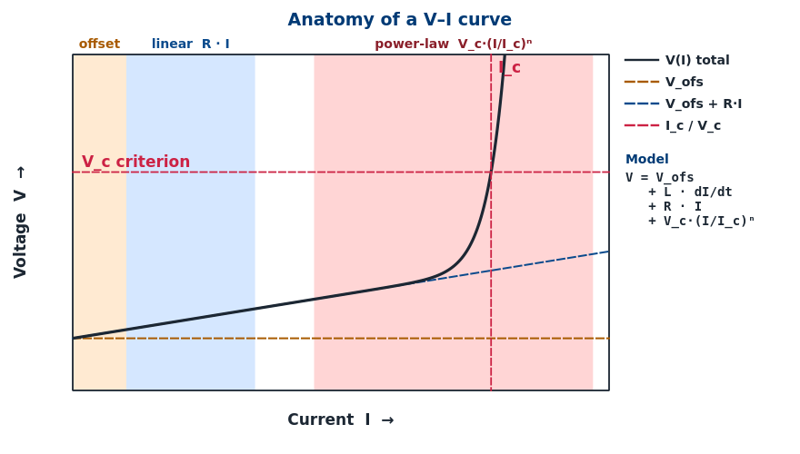
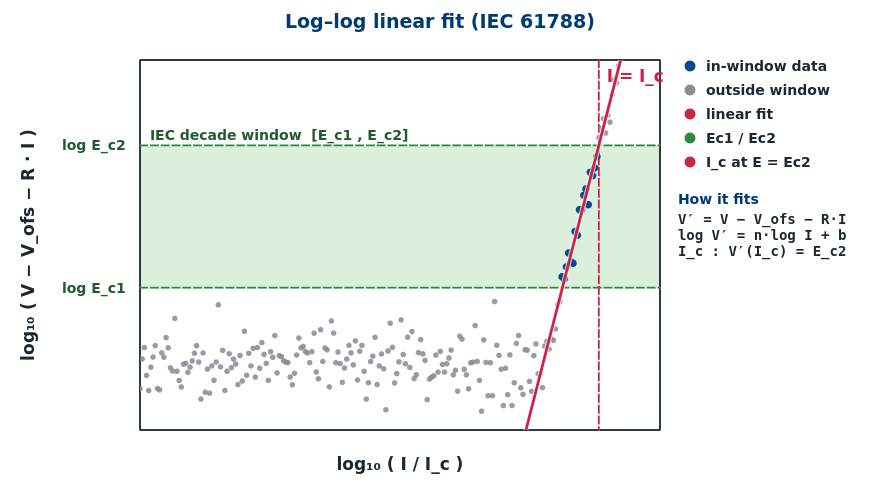

## Install (Windows PowerShell)

```powershell
cd "D:\Superconductor V-I Fitting"
python -m venv .venv
.\.venv\Scripts\Activate.ps1
pip install --upgrade pip
pip install -e .
```

## Run standalone

```bash
python -m fitting
```

The app shows a gray version label at the bottom-right:
`v1.0 (build N)` where `N` follows the git commit count.

## Build one-file Windows EXE

```powershell
pip install pyinstaller
pyinstaller --clean --noconfirm --distpath build superconductorfit.spec
```

Output: `build\Superconductor fitting v1.0 build N.exe` — copy to any
Windows machine and run directly.

## Embedding in another Qt app

```python
from types import SimpleNamespace
from PyQt5.QtWidgets import QWidget
from fitting import setup_data_fitting_tab_layout, tab as _tab

host.ui_state = SimpleNamespace()
host.ui_state.data_fitting_tab = QWidget()    # your tab container
host.data_fitting_refresh_preview = lambda *_: _tab.refresh_preview(host)
# ...plus the other `data_fitting_*` methods (see standalone.DataFittingWindow).
setup_data_fitting_tab_layout(host)
```

## Public API

```python
from fitting import (
    FitResult, FitSettings, run_full_fit, robust_view_range,
    setup_data_fitting_tab_layout,
)
```

`run_full_fit(t, x, y, settings)` returns a `FitResult` without any Qt
dependencies, so the math layer can be used in scripts and tests.

---

# Superconductor V–I Fitting

Self-contained Python/Qt tool that extracts the **critical current `I_c`**, the
**n-value** and the **resistive baseline** from a recorded voltage–current
ramp using the IEC 61788 power-law criterion. It bundles a pure-numpy/scipy
math layer, an interactive PyQt5 UI with an OriginLab-style graph-settings
dialog, presets, multi-curve management, and a per-fit TDMS side-car report.



---

## Overview

The fitted relation is the IEC 61788 power-law model with an inductive term
and a resistive baseline:

- Without sample length: **`V = V_ofs + L·dI/dt + R·I + V_c·(I/I_c)ⁿ`**
- With sample length `L_s`: **`E = (L/L_s)·dI/dt + ρ·I + E_c·(I/I_c)ⁿ`**

Three additive parts are extracted: an **offset / inductive** term
(`V_ofs + L·dI/dt`), a **linear baseline** (`R·I` or `ρ·I`) below `I_c`, and
the **power-law transition** `V_c·(I/I_c)ⁿ` on the baseline-subtracted
residual.

---

## The two fitting methods

| | **Log–log linear** (default — IEC 61788) | **Non-linear (Levenberg–Marquardt)** |
|---|---|---|
| **What it does** | Subtracts the linear baseline first (`V′ = V − V_ofs − R·I`), then fits `log V′` vs `log I` with a straight line on the IEC decade window `[E_c1, E_c2]`. Slope = `n`; `I_c` at `V′ = E_c2`. | Fits the full coupled model directly to the raw V–I data inside an outer self-consistency loop on `I_c`. |
| **Pros** | IEC reference method → reproducible across labs. Closed-form regression, very fast. Robust against multiplicative noise on V. | Returns proper σ on every parameter. Handles inductive / baseline coupling natively. Uses the entire ramp. |
| **Cons** | Sensitive to errors in the pre-subtracted baseline. Only data inside the decade is used. Needs a few dozen samples between `E_c1` and `E_c2`. | Slower; can fail to converge with poor windows or seeds. No standardized acceptance criterion. |

> **Recommendation:** start with **log–log linear** because it is the
> IEC 61788 reference method. Switch to non-linear only if the log–log
> fit reports *insufficient n-window points* or the ramp is noticeably
> inductive.

---

## Log–log linear fit (IEC 61788)



The same curve in log–log space. The shaded green band is the IEC
decade window `[E_c1, E_c2]`; blue points fall inside the monotonic
transition segment and enter the fit, grey points sit on the noise floor
or outside the window and are excluded.

The procedure is: fit `V_ofs + R·I` on points well below `I_c`, subtract
it to get `V′(I)`, then on the **decade window** `[E_c1, E_c2]` fit
`log₁₀ V′` vs `log₁₀ I` with `numpy.polyfit` (closed form, no iteration).
The slope is **`n`**; **`I_c`** is the current at which `V′ = E_c2`.

**IEC 61788 defaults:** `E_c2 = 1 µV/cm` (criterion for HTS at 77 K),
`E_c1 = 0.1 µV/cm`, ≥ 50 samples inside the decade. Without a sample
length the equivalent `V_c` (default 1 mV) is used and `E_c1`, `E_c2`
scale by the same ratio.

---

## How to fit

1. **Load TDMS** and (optionally) the metadata side-car.
2. Pick **Time / Current / Voltage** channels and verify the per-channel
   scale & offset.
3. Provide the **sample length `L_s`** for E-field results, or leave it
   blank for V-based results.
4. Drag the three coloured bands so the **dI/dt**, **linear** and
   **power-law** windows each cover a clean part of the curve.
5. Press **Run Fit** and read `I_c`, `n`, σ, R² in the result block.

Watch the warning bar — *“ramp too fast”*, *“insufficient n-window
points”* or R² < 0.99 mean you should retune the windows.

---

## Settings & options

The fit-method radio (**Log–log** vs **Non-linear**) decides which
parameters are honoured:

| Parameter | Log–log | Non-linear |
|---|:---:|:---:|
| `E_c1`, `E_c2` (decade window) | ✓ | — |
| `V_c` / `E_c` (criterion) | ✓ | ✓ |
| `Linear low / high` (baseline) | ✓ | ✓ |
| `Baseline mode` (OLS / Huber / Theil-Sen) | ✓ | ✓ |
| `Power low` / `Power V frac` | sanity bound | ✓ (full window) |
| `Max iterations`, `I_c stop tol`, `Chi-sqr tol` | — | ✓ |
| `dI/dt low / high`, `Zero-I fraction` | diagnostics | diagnostics |

**Save preset…** / **Load preset…** persist every numeric setting and
the chosen fit method as JSON. **Per-curve profiles** remember each
curve's individual windows. **Export…** writes a publication-quality
PNG/PDF and the `*_fit_report.tdms` side-car.

---

## Metadata fields stored in `*_fit_report.tdms`

Every successful fit becomes one channel in the `FitResults` group of
the side-car next to the source recording. Properties survive
round-trips through LabVIEW, OriginLab and Python.

**Primary parameters**

| Property | Unit | Description |
|---|---|---|
| `Ic` | A | Critical current at the chosen criterion. |
| `n` | — | n-value (transition sharpness). |
| `sigma_Ic` / `sigma_n` | A / — | 1-σ uncertainties from the covariance matrix. |
| `R_squared` | — | Coefficient of determination of the power-law fit. |

**Criterion & n-window**

| Property | Unit | Description |
|---|---|---|
| `criterion_value` | V or V/cm | Applied `V_c` / `E_c`. |
| `criterion_name` / `criterion_unit` | — | Human-readable label and unit. |
| `Ec1`, `Ec2` | V/cm | IEC decade window (only set for log–log fits). |
| `n_window_I_lo_A`, `n_window_I_hi_A` | A | Current bounds of the n-value window actually used. |
| `n_points_used` | — | Samples that entered the power-law fit. |

**Baseline decomposition** — `V_total = V_ofs + L·dI/dt + R·I + V_c·(I/I_c)ⁿ`

| Property | Unit | Description |
|---|---|---|
| `V_ofs` | V | Thermal/instrumental offset. |
| `V0_inductive` | V | Inductive voltage at the dI/dt-window center. |
| `inductance_L_H` | H | Effective lead/sample inductance. |
| `R_or_rho` | Ω or Ω/cm | Resistive baseline; unit follows `R_unit`. |

**Diagnostic flags**

| Property | Type | Meaning |
|---|---|---|
| `ramp_inductive_ratio` | float | Inductive voltage / criterion voltage. |
| `ramp_too_fast` | True/False | Set if the inductive term dominates — lower dI/dt. |
| `insufficient_n_points` | True/False | Set if the power-law window has too few samples. |
| `thermal_offset_applied` | True/False | Set if a non-zero `V_ofs` was subtracted. |
| `uses_sample_length` | True/False | True for E-field fits (with `L_s`), False otherwise. |
| `baseline_mode` | string | Step-3 baseline estimator used (`ols`, `huber`, `theil_sen`). |

> Booleans are stored as the strings `"True"` / `"False"` for round-trip
> safety with LabVIEW and Origin readers.

---

## Files

| File | Purpose |
|---|---|
| `fitting/service.py` | Pure math (numpy / scipy). No Qt imports. |
| `fitting/extras.py` | Graph-settings dialog, export dialog, presets, widgets. |
| `fitting/tab.py` | Qt layout, action functions, in-app help dialog. |
| `fitting/standalone.py` | Minimal `QMainWindow` that wraps the tab for standalone use. |
| `fitting/__main__.py` | `python -m fitting` entry point. |

---

## In-app help

Press **? Help** next to *Load preset…* in the running app to open a
non-modal, tabbed window with the full Overview, Log–log fit, How to
fit, Settings & options and Metadata pages.
