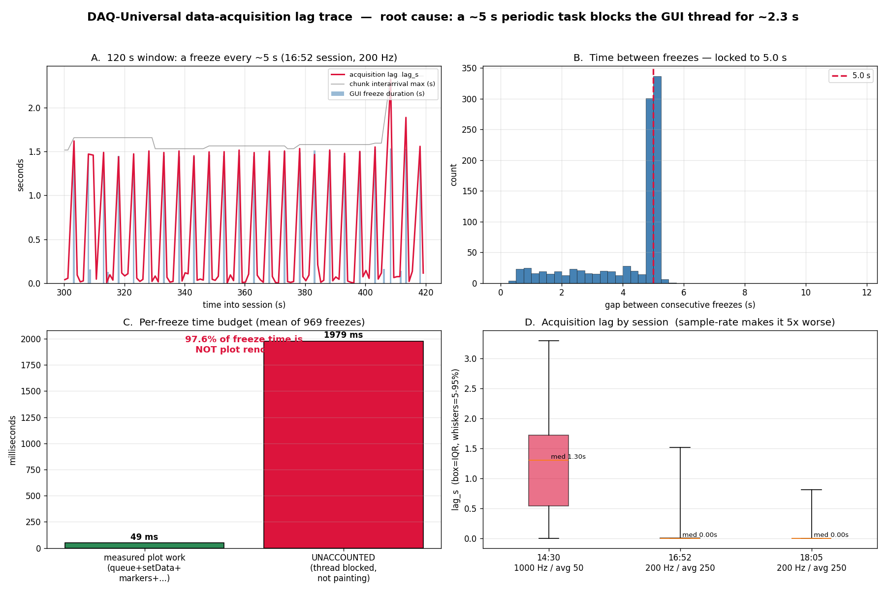

# DAQ-Universal data-acquisition lag — root-cause trace (2026-06-03)

Investigation of the "very very annoying" acquisition lag, where the UI also
goes **completely unresponsive**. Source data: three `runtime_telemetry`
sessions and two `raw_data` event logs exported on 2026-06-03.

> **Scope note.** These logs come from **DAQ-Universal** (the upstream
> acquisition app, build `1c8adff5276c`). *This* repository is the downstream
> Superconductor V–I fitting tool, which only *loads* DAQ-U's TDMS files. The
> bug therefore lives in **DAQ-U's GUI loop**, not in this repo — this folder
> is the evidence + a reproducible analyzer, not a fix.



## Verdict

A **fixed ~5.0 s periodic task runs on DAQ-U's Qt GUI/main thread and blocks
it for ~2.3 s** (median; up to 3.3 s). The thread is *blocked*, not painting,
so it both freezes the UI and stalls the acquisition→display pipeline.

```
every 5.0 s  →  a task runs on the GUI/main thread
             →  it BLOCKS that thread for ~2.3 s (median, up to 3.3 s)
             →  Qt event loop frozen  ⇒  UI unresponsive  (~50–58% of wall time)
             →  acquisition→display pipeline stalls: chunks that normally
                arrive every ~63 ms burst in after ~3000 ms; the qd / tdms /
                gui queues all flood together to 250–290 deep
             →  the live plot / store falls 2–3 s behind real time = the lag
```

## Evidence

| Observation | Value | Where |
|---|---|---|
| App's own warning | `Slow GUI frame … (budget 66.7 ms)` ×969 in 68 min | `raw_data` log, `src.ui.runtime` |
| Freeze duration | median **2,345 ms**, max 3,258 ms | slow-frame totals |
| Measured plot work in those frames | mean **~49 ms** | queue+setData+markers+yRange+paint |
| **Unaccounted (blocked) time** | **97.6 %** of the freeze | total − measured |
| Period | **5.0 s** (658/969 gaps at 5 s) | inter-freeze gaps |
| Fixed-interval timer? | yes — 55/59 freezes at `epoch mod 5 s == 3.0` (18:05 log) | wall-clock phase |
| UI frozen fraction | **~50–58 % of wall-clock time** | mean freeze × rate |
| Pipeline symptom | `chunk_interarrival_ms.max ≈ 3000`, `peak_q` qd≈280 / tdms≈230 / gui≈55 | telemetry |

## Ruled out (with evidence)

- **Data loss** — `gui_drops = cache_drops = 0` in every session. Recorded TDMS
  files are intact; the lag is purely in the live view, a recoverable backlog.
- **TDMS→disk writer** — goes `overloaded` 14–34 % of the time but
  `writer_backlog_s ≈ 0`; it bursts and catches up. Not the cause.
- **Nominal cloud upload** — the `upload` worker never ran in these sessions.
- **`range_monitor`** — emits ~7,300 warnings but at a steady ~1.8/s; its
  events do **not** cluster around the freezes.
- **Plot rendering / overlays / LOD decimation** — working fine
  (`store:lod`, ~3,700 pts/frame, ~99 % overlay-cache hits in healthy
  sessions); 97.6 % of the freeze is *outside* all paint phases.

## Aggravating factor — sample rate

| Session | Config | median `lag_s` | notes |
|---|---|---|---|
| 14:30 | **1000 Hz / avg 50** | **1.30 s** | task can't finish before the next fires; `gui_q` stuck ~43 |
| 16:52 | 200 Hz / avg 250 | 0.00 s | freeze spikes only |
| 18:05 | 200 Hz / avg 250 | 0.00 s | freeze spikes only |

The cost scales with the data volume in the plot buffer → the periodic task is
almost certainly doing a **full-history pass**.

## Most likely culprit & how to confirm (in the DAQ-U repo)

Signature = *fixed 5 s · ~2.3 s · main thread · uninstrumented · scales with
buffer size*. Prime suspect: a **5 s `QTimer` whose slot does a heavy
synchronous full-buffer pass on the GUI thread** — full re-decimation / LOD
rebuild, full-history autorange, a stats/summary recompute, an
autosave/checkpoint, or `gc.collect()`.

1. Grep DAQ-U for a timer with interval `5000` / `5.0` bound to a main-thread slot.
2. Look for periodic *refresh-all / rebuild / recompute-range / autosave / flush / snapshot*.
3. **Quick confirm:** set that timer to 60 s — the 5 s sawtooth should vanish.
4. **Fix direction:** move the work to a `QThreadPool`/worker, make it
   *incremental* (process only new samples, not the whole tail), or throttle it.
   The existing `Slow GUI frame` log should be extended to time that 5 s slot —
   it is currently the uninstrumented 97.6 %.

## Reproduce

```bash
python docs/daq-lag-analysis/analyze_lag.py <dir-with-jsonl-dumps> --plot trace.png
```
